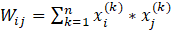

# Single-Layer_Perceptron
A single-layer perceptron is a linear classification algorithm, the principle of which is based on a model of a nerve cell - a neuron. This is an example of a neural network with one hidden layer.

Input: two vectors x1 and x2 - a training set. The weight matrix for these vectors is calculated by the formula: 

,

where Wij is the element of the weight matrix, n is the number of input vectors, xi and xj are the elements of the kth vector. Diagonal elements are equal to zero.
Vector z is a vector that we want to recognize using a neural network.

The result of the function is calculated by the formula: y = F(W*z). Under the action of the activation function, the resulting elements of the vector that >= 0 are replaced by 1, and those that < 0 are replaced by -1.

If the y value does not match the z value, then the current y is replaced by z and the function is calculated again. This continues until y matches z or until the specified iterations end.
